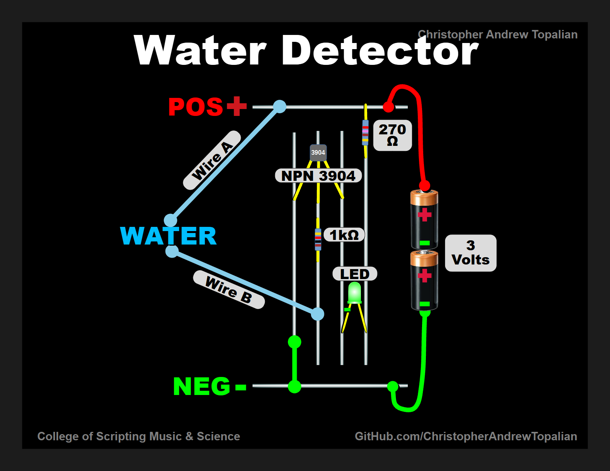
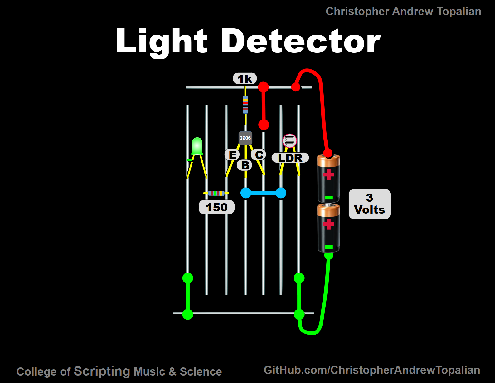

# CATopalian Electronics
An Electronics course for beginners that focuses on Circuit Design.

---

---

---

## CIRCUITS

[Water Detector](src/circuits/water_detector/water_detector.md)  

---

[Light Detector](src/circuits/light_detector/light_detector.md)

---

//----//

// Dedicated to God the Father  
// All Rights Reserved Christopher Andrew Topalian Copyright 2000-2025  
// https://github.com/ChristopherTopalian  
// https://github.com/ChristopherAndrewTopalian  
// https://sites.google.com/view/CollegeOfScripting

