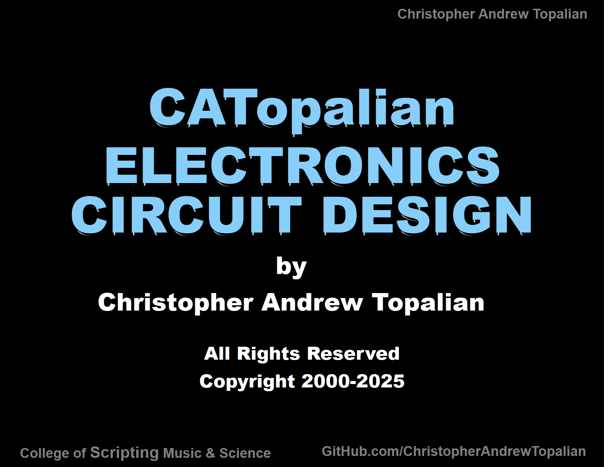
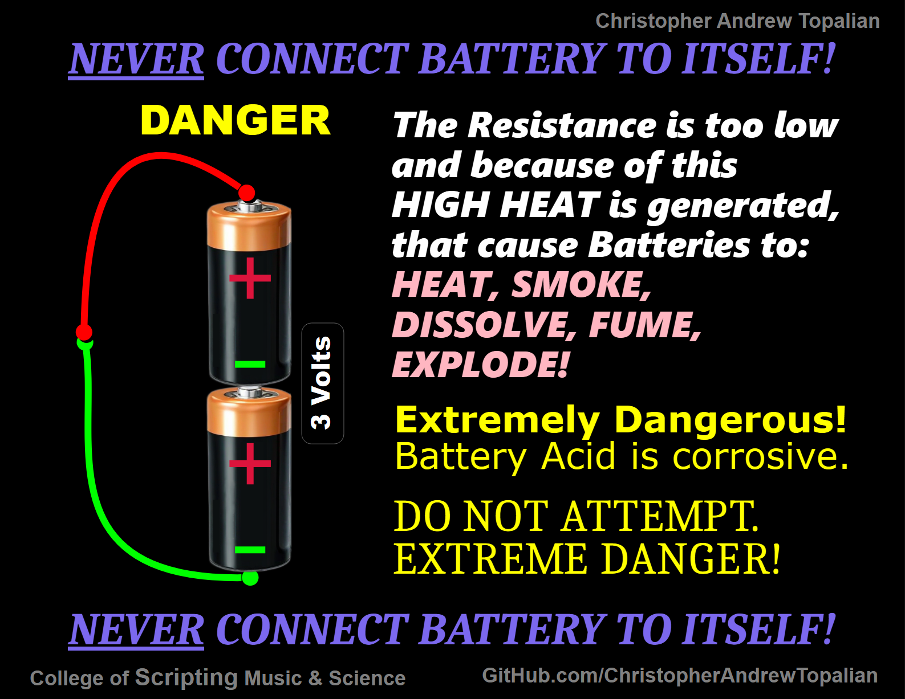

# CATopalian Electronics
An Electronics course for beginners that focuses on Circuit Design.

---

---

---

---

[Electronics Inventory](src/electronics_inventory/electronics_inventory.md)

---

## CIRCUITS

## [Water Detector](src/circuits/water_detector/water_detector.md)  

---

## [Light Detector](src/circuits/light_detector/light_detector.md)

---

## [Dark Detector](src/circuits/dark_detector/dark_detector.md)

---

## [IR Object Detector LED Starts On (Infrared)](src/circuits/IR_Object_Detector_LED_Starts_On_(Infrared)/IR_Object_Detector_LED_Starts_On_(Infrared).md)

/textures/IR_Object_Detector_LED_Starts_On_(Infrared).webp)

//----//

// Dedicated to God the Father  
// All Rights Reserved Christopher Andrew Topalian Copyright 2000-2025  
// https://github.com/ChristopherTopalian  
// https://github.com/ChristopherAndrewTopalian  
// https://sites.google.com/view/CollegeOfScripting

