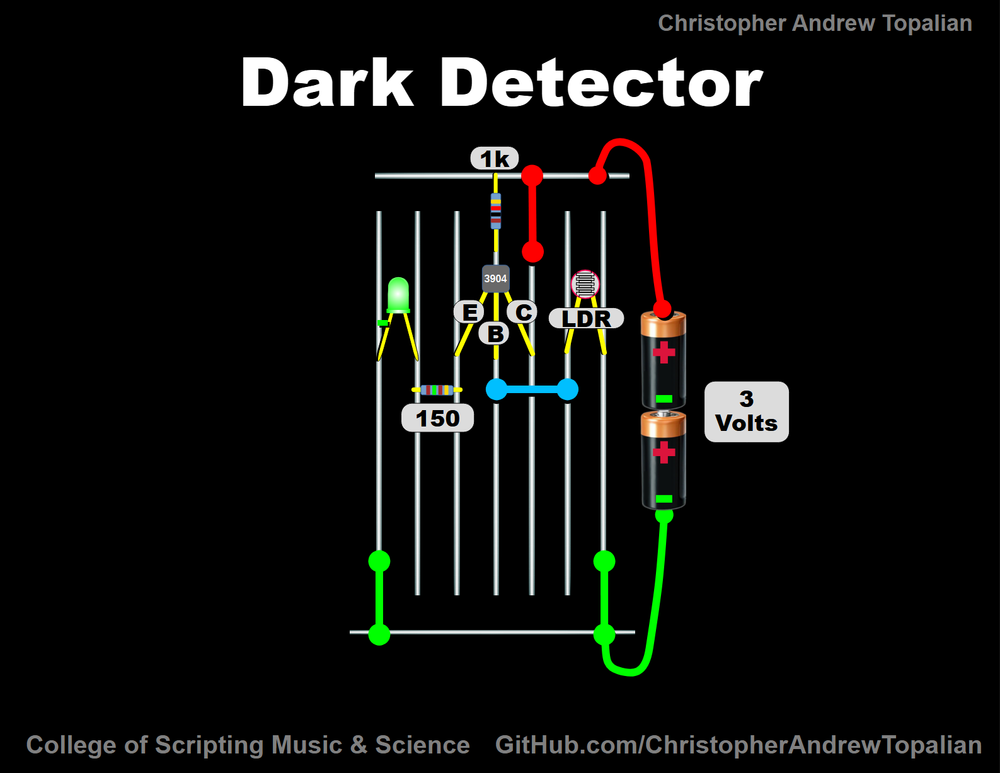

# Dark Detector

---

# Dark Detector Circuit (Using 2N3904 Transistor)

## Overview

This circuit is called a **Dark Detector** because the LED lights up only when the environment becomes dark. It uses a **light-dependent resistor (LDR)** as a sensor, a **2N3904 NPN transistor** as a switch, and a few passive components (resistors, LED, power supply).

When light levels are high, the LED is off.
When it becomes dark, the LED automatically turns on.

---

## Components Used

* **1 × Green LED** (indicator light)
* **1 × 2N3904 NPN transistor** (acts as an electronic switch)
* **1 × Light-Dependent Resistor (LDR)** (senses light level)
* **1 × 1 kΩ resistor** (base bias resistor)
* **1 × 150 Ω resistor** (current-limiting resistor for the LED)
* **2 × AA batteries (3V total supply)**
* Breadboard + connecting wires

---

## Step-by-Step Explanation

### 1. The Power Supply

* The circuit is powered by **3 volts** from two AA batteries.
* The **red rail** is positive (+3V), and the **green rail** is negative (ground).

---

### 2. The LED and Current-Limiting Resistor

* The **green LED** is connected to the **emitter (E)** of the 2N3904 transistor.
* A **150 Ω resistor** is in series with the LED to prevent too much current from damaging it.
* Without this resistor, the LED could burn out.

---

### 3. The Transistor (2N3904)

* A transistor has **three legs**:

  * **Collector (C)** – input for current from the positive supply.
  * **Base (B)** – control pin (decides if the transistor conducts or not).
  * **Emitter (E)** – output where current flows out, in this case to the LED.

* In this circuit, the transistor is acting as a **switch**:

  * When light is detected (LDR has low resistance), the transistor stays **off**.
  * When it’s dark (LDR resistance rises), the transistor turns **on**, allowing current to flow and light the LED.

---

### 4. The Base Resistor (1 kΩ)

* The **1 kΩ resistor** connects the base of the transistor to the positive rail.
* This resistor ensures that the base only gets a **safe, small amount of current**.
* Without it, the base could receive too much current and damage the transistor.

---

### 5. The LDR (Light-Dependent Resistor)

* The LDR’s resistance changes with light:

  * **In bright light:** Resistance is very low (almost like a wire).
  * **In darkness:** Resistance is very high (like a big resistor).

* In this circuit:

  * When it’s **bright**, the LDR pulls the base voltage high, preventing the transistor from switching on.
  * When it’s **dark**, the LDR’s resistance rises, pulling the base low through the 1 kΩ resistor, which **activates the transistor**.

---

### 6. How the Circuit Works Together

1. **Light Present (Daytime)**

   * LDR resistance is low.
   * Base of the transistor gets enough voltage to keep it off.
   * No current flows from collector to emitter.
   * The LED stays **off**.

2. **Darkness (Nighttime)**

   * LDR resistance increases greatly.
   * Base current drops.
   * The transistor turns **on**, connecting collector to emitter.
   * Current flows through the LED and 150 Ω resistor.
   * The LED lights up, indicating **darkness**.

---

## Why This Circuit Is Useful

* Acts as an **automatic night light**.
* Teaches the principle of a **transistor as a switch**.
* Demonstrates how an **LDR can sense light levels**.
* Simple enough for beginners but powerful enough to show how **sensors + transistors** interact.

---

## Key Learning Points

* An **LDR is not a fixed resistor**; it varies with light.
* A **transistor** can be used as an **automatic switch**.
* **Resistors** are crucial for controlling current and protecting components.
* By combining these parts, we build a circuit that responds to the environment.

---

⚡ **Experiment Idea for Beginners**:

* Try replacing the **1 kΩ base resistor** with **different values (10 kΩ, 100 kΩ, 470 Ω, etc.)** and observe how the sensitivity of the circuit changes.

---

//----//

// Dedicated to God the Father  
// All Rights Reserved Christopher Andrew Topalian Copyright 2000-2025  
// https://github.com/ChristopherTopalian  
// https://github.com/ChristopherAndrewTopalian  
// https://sites.google.com/view/CollegeOfScripting

