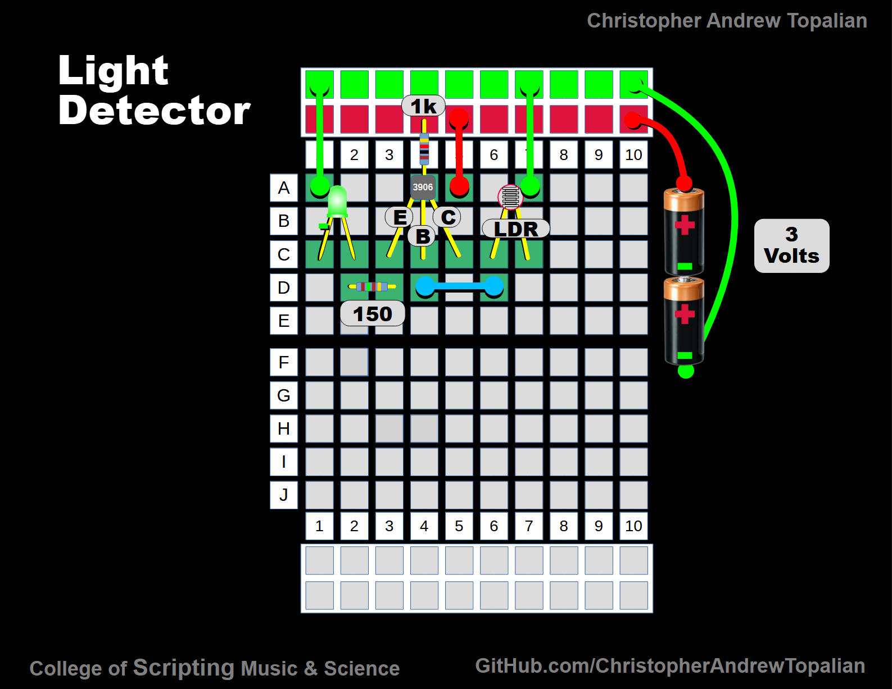

# Light Detector

Video: https://www.youtube.com/watch?v=rXRMCW10-IA

---

# Light Detector Circuit (Breadboard Implementation)

This circuit demonstrates how a **Light Dependent Resistor (LDR)** can be used in conjunction with a **bipolar junction transistor (BJT)** to form a simple **light detector**. When light falls on the LDR, the circuit responds by driving a **green LED**. The LED therefore serves as a visual indicator of illumination levels.

---

## Components Used
- **Green LED** (Light Emitting Diode)  
  Used as the visual output indicator. Forward voltage ≈ 2.0 V, typical forward current ≈ 10–20 mA.  

- **150 Ω resistor**  
  Serves as the current-limiting resistor for the LED, ensuring the LED does not exceed safe current levels when forward-biased.  

- **3906 PNP transistor**  
  A general-purpose PNP transistor. Functions as a current amplifier in this design: a small base current (through the LDR and bias resistor) controls a larger current through the LED.  

- **1 kΩ resistor**  
  Provides base biasing for the transistor, setting the sensitivity of the light-detection threshold.  

- **LDR (Light Dependent Resistor)**  
  A resistor whose resistance decreases with increasing light intensity. Under bright light, its resistance may fall below 1 kΩ; in darkness it can rise to several hundred kΩ.  

- **4 jumper wires**  
  Connect circuit nodes across the breadboard: three establish supply rails (positive and negative), and one links the LDR to the transistor base node.  

- **Power source: 3 V (two 1.5 V batteries in series)**  
  Provides the required supply voltage. This value is chosen so the LED operates within its safe forward voltage while keeping the circuit simple.

---

## Circuit Operation

1. **Power Supply**  
   - Positive rail: connected to the top red line on the breadboard.  
   - Negative rail: connected to the top blue line on the breadboard.  

2. **Transistor Configuration (PNP, 3906)**  
   - **Emitter (E):** Connected to the positive supply (+3 V).  
   - **Collector (C):** Connected to the LED and its series 150 Ω resistor, which then returns to ground.  
   - **Base (B):** Connected through the LDR and 1 kΩ resistor to the negative supply.  

   This forms a **light-controlled switch**: the PNP transistor conducts when its base is pulled lower (more negative) than its emitter.  

3. **Light Detection Mechanism**  
   - In darkness, the LDR has a very high resistance. This prevents sufficient current from flowing into the transistor’s base, so the transistor remains **off**, and the LED stays dark.  
   - As light intensity increases, the LDR resistance decreases. This allows base current to flow through the 1 kΩ resistor and the LDR, pulling the base low relative to the emitter.  
   - Once the base–emitter junction becomes forward biased (~0.7 V), the transistor turns **on**, allowing current to flow from emitter → collector → LED → resistor → ground.  
   - The LED lights up, signaling the presence of light.  

---

## Current Flow Explanation

Although conventional current is often drawn from **positive to negative**, it is physically electrons that flow from negative to positive. For clarity:

- **Battery negative (–)** → supplies electrons into the breadboard ground rail.  
- Electrons flow through the **150 Ω resistor** into the LED’s cathode, lighting the LED.  
- They continue into the **collector** of the transistor, out the **emitter**, and return to the **positive rail** of the battery.  
- Simultaneously, a small fraction of current flows from the base circuit: through the **LDR** and **1 kΩ resistor**, into the transistor’s base, enabling conduction.  

---

## Key Concepts Demonstrated
- **Photoresistive behavior** of LDRs (resistance decreases with increasing light).  
- **Transistor as a switch:** the PNP transistor amplifies small base currents into larger collector currents.  
- **Current limiting:** essential to protect the LED from excess current.  
- **Low-voltage operation:** shows that simple detection circuits can run on small batteries.  

---

## Variations for Study
- **Sensitivity adjustment:** Replace the 1 kΩ base resistor with a variable resistor (potentiometer, e.g. 10 kΩ) to adjust the light level threshold at which the LED turns on.  
- **Alternative transistor types:** An NPN transistor (e.g., 2N3904) could be used if the circuit is rearranged appropriately.  
- **Higher supply voltages:** Adding more LEDs in series or using a 5 V supply, while recalculating resistors, demonstrates Ohm’s law in practice.  
- **Output options:** Instead of driving an LED, the transistor could control a relay, buzzer, or microcontroller input.  

---

## Summary
This simple circuit illustrates the practical use of an LDR and a transistor to create a functional light detector. It teaches students the relationships among **resistance, light intensity, transistor biasing, and LED indication**, while emphasizing the importance of component selection and current control.

---

//----//

// Dedicated to God the Father  
// All Rights Reserved Christopher Andrew Topalian Copyright 2000-2025  
// https://github.com/ChristopherTopalian  
// https://github.com/ChristopherAndrewTopalian  
// https://sites.google.com/view/CollegeOfScripting

