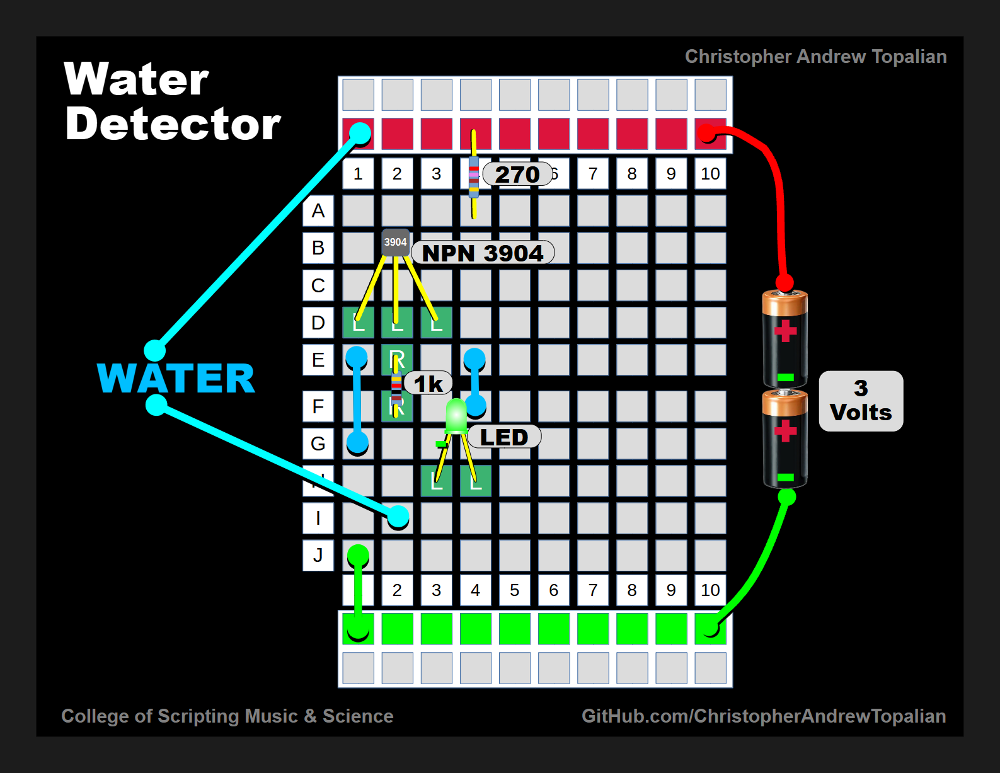

# **Water Detector Circuit** 

### 🔧 **Purpose of the Circuit**

When water is present between **Wire A** and **Wire B** this circuit **detects the water** and makes the LED light up. 

---

### 🧩 **Components**

* **NPN 3904 Transistor**
* **270Ω resistor** (on collector side)
* **1kΩ resistor** (on base side)
* **LED**
* **3V Power Source** (2x AA batteries)
* **2 wires** exposed to possible water contact

---

### ⚡ **How It Works**

#### 1. **Power Supply**

* The **positive (+)** terminal is connected through a **270Ω resistor** to the **collector** of the NPN 3904 transistor.
* The **negative (–)** is the common ground (GND).

#### 2. **Transistor Basics**

* An **NPN transistor** only conducts from **collector to emitter** when there is current going into the **base**.
* The **emitter** is grounded (NEG).

#### 3. **Water Detection Mechanism**

* **Wire A and Wire B** are probes that will detect water.
* When water connects them (water conducts slightly), a tiny current flows through the water and the **1kΩ resistor** into the **base** of the transistor.

#### 4. **Triggering the Transistor**

* This small base current allows **current to flow** from the collector to the emitter, turning the transistor **on**.
* Now current flows through the **270Ω resistor**, **through the collector-emitter path**, and through the **LED** to ground, turning the **LED ON**.

#### 5. **When There's No Water**

* No base current → transistor stays **off**
* No LED current path → **LED stays off**

---

### 💡 Why It Works

* Water completes a very **weak circuit** between the probes (A and B).
* The transistor **amplifies** this weak signal to control the brighter LED.
* It's a great example of **using a transistor as a switch**.

---

## ✅ ****NPN 2N3904 Transistor**
## Pinout from Left to Right (Flat Side Facing You)**

1. **E** = Emitter (left)
2. **B** = Base (middle)
3. **C** = Collector (right)

---

### 🔁 Summary

* **Emitter**: Goes to ground in this water detector circuit.
* **Base**: Connects through a resistor and the water probes.
* **Collector**: Connects to the positive rail through a resistor and to the LED.

---

//----//

// Dedicated to God the Father  
// All Rights Reserved Christopher Andrew Topalian Copyright 2000-2025  
// https://github.com/ChristopherTopalian  
// https://github.com/ChristopherAndrewTopalian  
// https://sites.google.com/view/CollegeOfScripting

